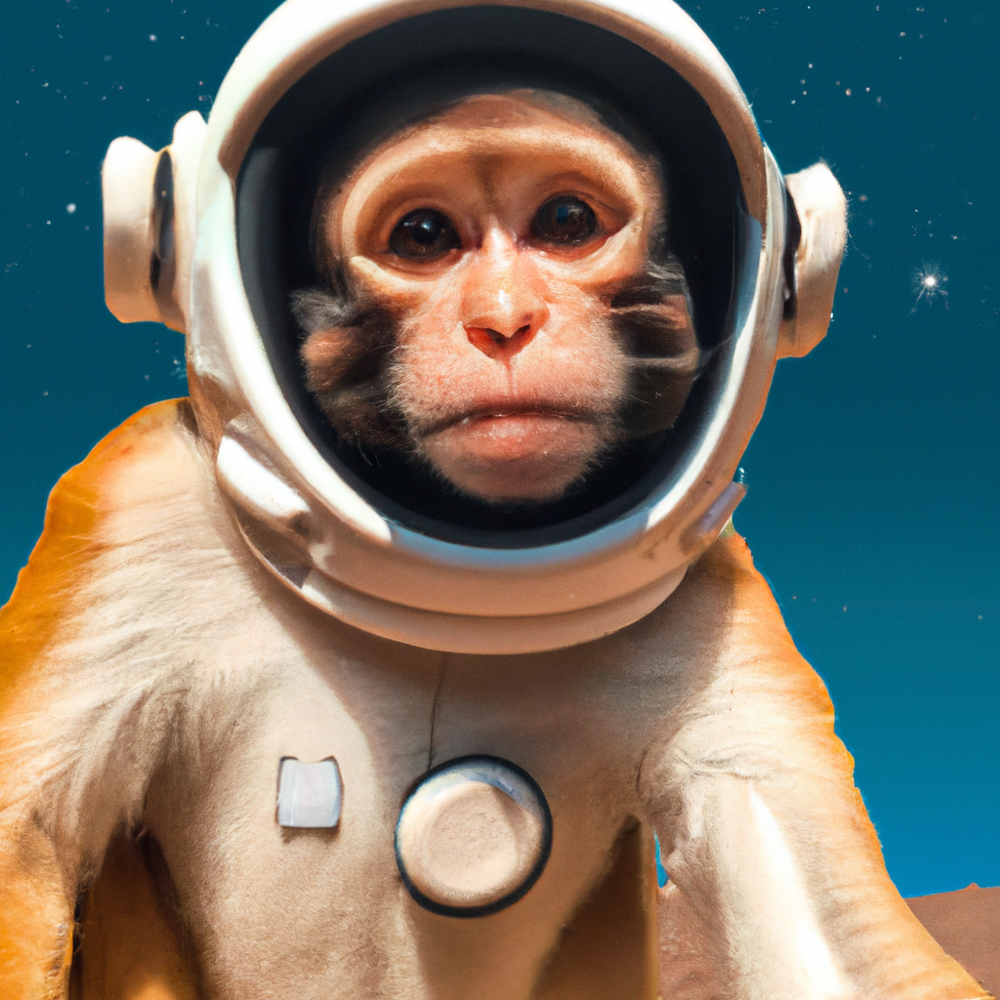

# DALL-E 2 - Open AI Image Generation API

## Using Laravel HTTP Client

DALL·E 2 is an AI system that can create realistic images and art from a description in natural language.

DALL·E 2 can create original, realistic images and art from a text description. It can combine concepts, attributes, and styles.

In January 2021, OpenAI introduced DALL·E. One year later, our newest system, DALL·E 2, generates more realistic and accurate images with 4x greater resolution.

## Empower People to Express Themselves Creatively

https://openai.com/dall-e-2

Open AI hope is that DALL·E 2 will empower people to express themselves creatively. DALL·E 2 also helps us understand how advanced AI systems see and understand our world, which is critical to our mission of creating AI that benefits humanity.


# Image Generation API

https://platform.openai.com/docs/guides/images


The image generations endpoint allows you to create an original image given a text prompt. Generated images can have a size of 256x256, 512x512, or 1024x1024 pixels. Smaller sizes are faster to generate. You can request 1-10 images at a time using the n parameter.

```
curl https://api.openai.com/v1/images/generations \
  -H "Content-Type: application/json" \
  -H "Authorization: Bearer $OPENAI_API_KEY" \
  -d '{
    "prompt": "a white siamese cat",
    "n": 1,
    "size": "1024x1024"
  }'
```

# Monkey Astronauts





# Preview

https://www.youtube.com/watch?v=mULSXVevNvQ